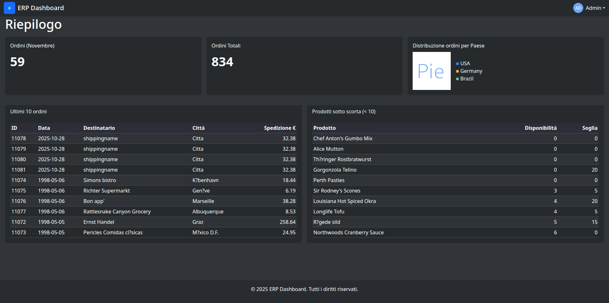

# Dashboard ERP

ERP dashboard frontend built with plain HTML, CSS, and JavaScript.

Demo site: https://frr0.github.io/Dashboard-ERP/



## What it is

This project is a small ERP-style dashboard for browsing and managing sample business data such as customers, products, orders, employees, categories, and shipping information.

## Main Pages

- `login.html` - login screen
- `dashboard.html` - main dashboard entry point
- `html/clienti.html` - customers
- `html/Prodotti.html` - products
- `html/ordini.html` - orders
- `html/dipendenti.html` - employees
- `html/categorie.html` - categories
- `html/sped.html` - shipping
- `html/riepilogo.html` - summary view

## Project Structure

- `css/` - stylesheets
- `js/` - application scripts
- `html/` - secondary pages
- `json/` - sample data sources
- `others/` - extra demo files

## Run Locally

Open `login.html` or `dashboard.html` directly in a browser, or serve the folder with any static file server.

Example:

```bash
python3 -m http.server 8000
```

Then open `http://localhost:8000/login.html`.

## Notes

- If GitHub Pages is used, make sure the published entry point matches the page you want to open by default.
- The sample data lives in the `json/` folder and is consumed by the JavaScript files in `js/`.
